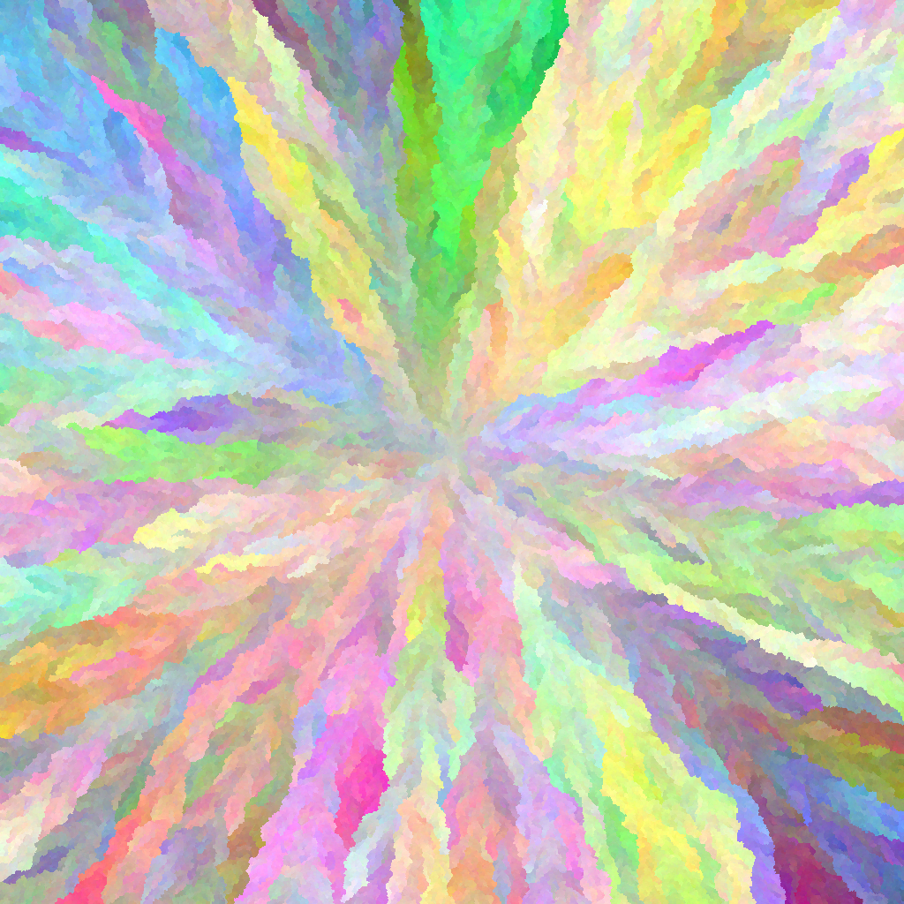

# BFS Image Creator


## Overview

This project generates an image using the Breadth-First Search (BFS) algorithm to adjust colors starting from the center of the image. It explores outward, adjusting pixel colors to create unique patterns.

## Installation

To set up your environment to run this project, follow these steps:

1. **Clone the repository:**

```bash
git clone [repository URL]
cd [project directory]
```

2. **Create and activate a virtual environment:**
```bash
python3 -m venv venv
source venv/bin/activate
```

**for windows:**
```bash
python -m venv venv
.\venv\Scripts\activate
```

3 **install the required packages:**
```bash
pip install -r requirements.txt
```

## Usage
You can run the script from the command line, specifying the image size, starting color, and color adjustment values. For example:


```
python main.py --width 100 --height 100 --start_color 200 200 200 --color_adjustment 4 4 4
```

***Arguments:**
- --width: Width of the image in pixels. Default is 100.
- --height: Height of the image in pixels. Default is 100.
- --start_color: Starting color of the image in RGB format. Default is 200 200 200.
- --color_adjustment: Color adjustment values for RGB channels. Default is 4 4 4.

## License

This project is open source and available under the MIT License.